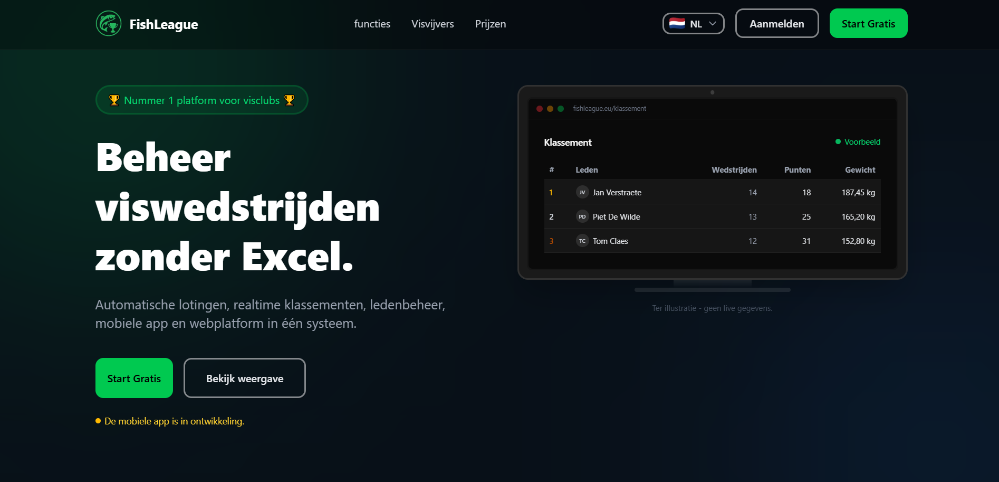
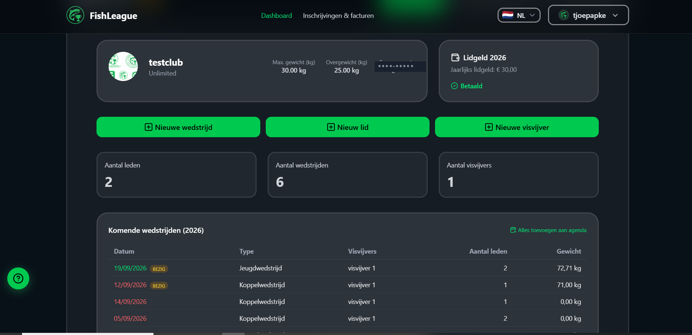
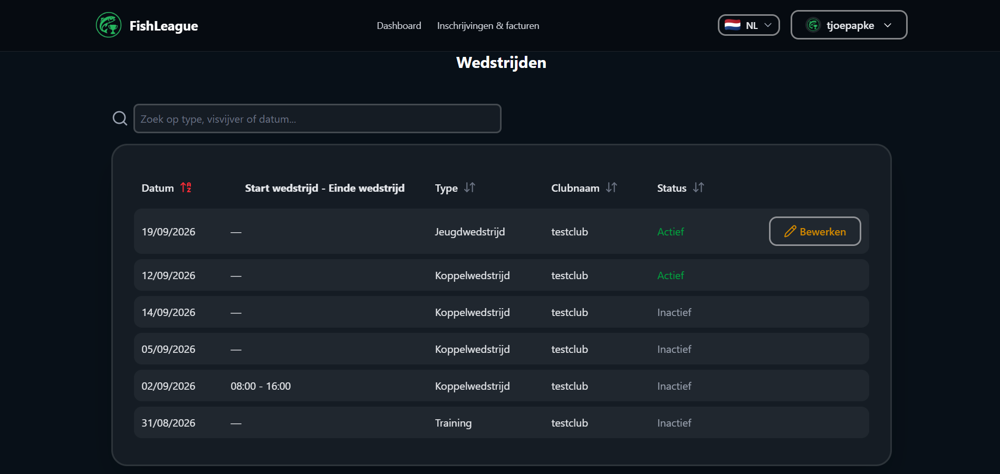
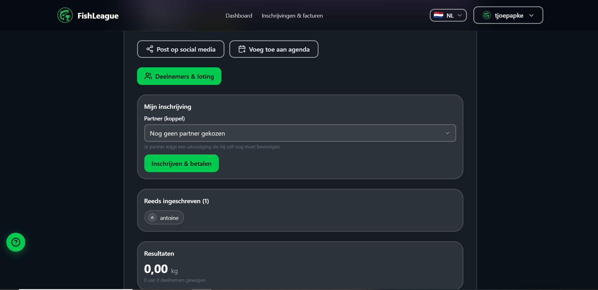
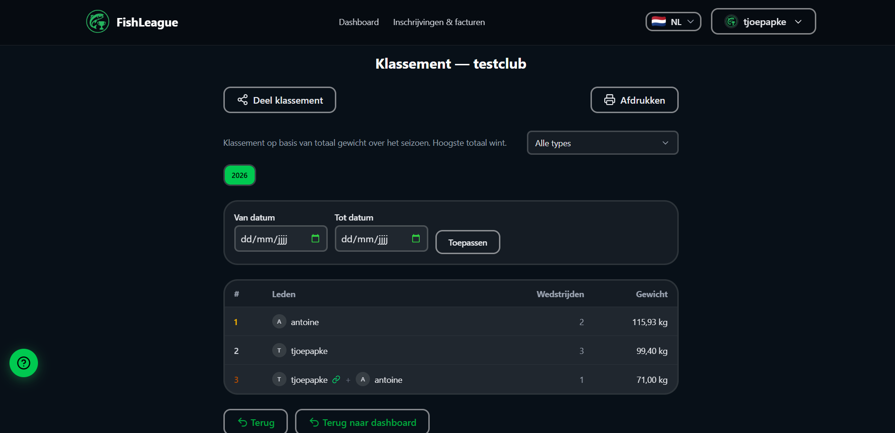
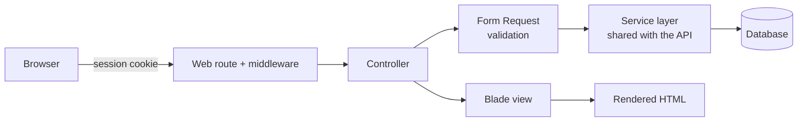

# AnglerHub Web

## About the Project

AnglerHub Web is the traditional, session-based Laravel/Blade side of the
same fishing competition platform as
[AnglerHub API](https://github.com/Voorbeelden/AnglerApi) and
[AnglerHub Mobile](https://github.com/Voorbeelden/AnglerMobile): the part
a club officer actually sits down at a computer and uses — managing
competitions, members, venues and payments — rather than the JSON contract
the mobile app talks to.

The dashboard and the API were never two separate applications that
happen to share a name. They share the same models, the same services,
the same Policies; a club owner approving a payment from the dashboard
and the same owner approving it from the mobile app hit the exact same
authorization rule. What differs is only ever the response format — a
Blade view here, JSON there. This repository is a **curated excerpt**,
not the full application — see [Repository scope](#repository-scope) for
what's shown and what deliberately isn't.

## Screenshots

A few screens from the live application, chosen to show the general look
and flow rather than internal configuration detail. Names, weights and
club data shown are test/demo values, not real club or member data.

<table>
<tr>
<td width="50%"><br><sub>Marketing homepage</sub></td>
<td width="50%"><br><sub>Club dashboard overview</sub></td>
</tr>
<tr>
<td width="50%"><br><sub>Competitions list</sub></td>
<td width="50%"><br><sub>Competition registration</sub></td>
</tr>
<tr>
<td width="50%"><br><sub>Standings, filterable by year/date range</sub></td>
<td></td>
</tr>
</table>

## What's here

- **Session-based web controllers** — classic Laravel MVC: a Blade view or
  a redirect with flashed status, no JSON envelope, no token auth.
- **Account security self-service** — a user's own device/session
  management (view and remotely revoke other active sessions), 2FA setup,
  and account deletion gated behind a fresh password confirmation.
- **A contact form with real spam protection** — server-verified
  reCAPTCHA plus a honeypot field, matching what's actually described as
  standard on [Websexpert](https://www.web-designs.eu) client sites.
- **Form Requests** for validation, kept separate from the controller.
- **A handful of the dashboard's reusable Blade/Alpine.js components**
  (accessible modal, styled confirm-dialog, a small toggle control) and
  the Tailwind v4 design-token layer they're built with.

## Technologies

- PHP / Laravel, Blade templating
- Alpine.js for declarative front-end interactivity
- Tailwind CSS v4, including custom `@utility` extensions
- Laravel Form Requests for validation
- Google reCAPTCHA + a honeypot field for spam protection

## Development Approach

This is the original surface of the application — the API in the sibling
repository came later, added on top of the same models and services once
a mobile client needed a way to reach the same data. That history shows
in how deliberately unexciting the controllers here are: a `Request`
comes in, gets validated (often through a dedicated Form Request), the
service layer does the actual work, and the response is either a Blade
view or a redirect with flashed session status — no JSON envelope, no
token handling, none of the API repo's concerns, because none of them are
relevant here.



## Architecture

**Session self-service, not just admin-managed security.**
`ProfileController::security()` lets a user see and remotely revoke their
own other active sessions (e.g. after losing a phone) — deliberately
*without* requiring password re-confirmation, since that would defeat the
point if the compromised device is the only one they can still log in on.
Account deletion goes the other way: it *does* require a fresh password
check, since there's no equivalent urgency working against it. Two
actions that look similar on the surface ("are you sure?") end up with
deliberately different confirmation requirements once you actually think
through what could go wrong with each.

**Front-end interactivity stays declarative.** Alpine.js is used directly
in Blade markup rather than reaching for a full SPA framework for a
server-rendered dashboard — see `modal.blade.php`, where `x-teleport` was
added specifically to escape a real CSS containment quirk
(`backdrop-filter` creates a new containment block for `position: fixed`
descendants), documented in the component itself rather than left as a
mystery for the next person to rediscover.

**Small, targeted converters instead of reaching for a bigger dependency.**
The design-token layer in `app.css` registers a handful of custom
Tailwind v4 `@utility` extensions (finer text sizes than the default
scale, a thicker border utility) rather than sprinkling one-off hardcoded
values across the templates that need them.

## Working with Data

Controllers here talk to the same Eloquent models and service layer as
the API — nothing about how data is fetched or validated is duplicated
per client. `ProfileUpdateRequest` is a representative example: field
validation (uniqueness checks included) lives in one Form Request class,
away from the controller, so `ProfileController::update()` reads as
"validate, then apply" rather than a wall of inline validation rules.

## Security and Privacy

- Real client identifiers, the production domain, and anything
  credential-shaped are replaced with placeholders or removed outright.
- Field and route names are translated from the original Dutch production
  code for the same reason as in the API repo: keeping this excerpt's
  exact strings distinct from what the live product actually uses.
- The screenshots above were chosen specifically to avoid internal
  configuration detail (permission matrices, exact business-rule
  thresholds) — general layout and flow only, and every visible name,
  club and weight is test data, not a real member's.
- The contact form's spam handling is intentionally layered: server-side
  reCAPTCHA verification *and* a honeypot field, so a bot that manages to
  defeat one still has to also leave a hidden field blank — the same
  approach [Websexpert](https://www.web-designs.eu) ships as standard on
  client sites.

## Repository layout

```
anglerhub-web/
├── app/Http/Controllers/
│   ├── ContactController.php               reCAPTCHA + honeypot spam protection
│   └── ProfileController.php               profile, 2FA, session management, account deletion
├── app/Http/Requests/
│   └── ProfileUpdateRequest.php            Form Request validation pattern
├── resources/
│   ├── views/components/
│   │   ├── modal.blade.php                 accessible modal shell (focus trap, teleport, ESC)
│   │   ├── confirm-form.blade.php          styled drop-in replacement for confirm()
│   │   └── segmented-toggle.blade.php      small reusable Alpine-driven toggle
│   └── css/app.css                         Tailwind v4 @utility extensions, print styles, a11y
└── docs/screenshots/                       the 5 screenshots shown above
```

## Repository scope

Why a separate repo from [AnglerHub API](https://github.com/Voorbeelden/AnglerApi)
in the first place: the dashboard and the API share the same underlying
models, services and Policies in the real application — this split is
about audience, not architecture. Someone evaluating "can this person
write a traditional, session-based Laravel app" can look here without the
JSON-API-specific code getting in the way, and vice versa in the API repo.

Within that scope:

- **Only a handful of the ~250 Blade views are included** — the three
  small, genuinely reusable components shown above. The screenshots give
  a sense of the rest without shipping the templates themselves.
- **The actual business-logic-heavy controllers are not included**
  (competition/schedule management, ~1000+ lines each) — this repo is
  about the MVC/session/component patterns, not the business rules. Same
  reasoning as the excluded scheduling controllers in the
  [Calenderapp excerpt](https://github.com/Voorbeelden/.NetCoreApp).
- **Payments, admin/support tooling, and email templates are not
  included.**

**This excerpt won't run standalone** — it references services, models
and Policies that aren't part of this repository. It's meant to be read
alongside its README, not deployed.

## Development Responsibilities

### Web Application Development
Session-based Laravel MVC: controllers, Form Requests, Blade views, and
the redirect/flash-status flow standard to a server-rendered dashboard.

### Front-End Development
Blade + Alpine.js for interactivity, Tailwind v4 for styling (including
custom `@utility` extensions), and accessibility details — focus
trapping, keyboard navigation, `prefers-reduced-motion` support — built
into the shared component layer rather than added per page.

### Security
Account self-service that's actually secure by default: session
visibility and remote revocation, 2FA, layered spam protection on public
forms (reCAPTCHA + honeypot), and confirmation requirements that match
the actual risk of each action rather than a single "are you sure?"
pattern applied uniformly.

### Data Management
Form Request-based validation kept out of controllers, backed by the
same Eloquent models and service layer the API repo uses — nothing here
duplicates validation or business rules per client.

### Testing
Manual and feature testing of the account-security flows specifically —
session revocation only ever affecting the acting user's own sessions,
2FA setup/verification, and the contact form's spam-protection layers
actually rejecting a submission that fails either check.

## Business Functionality

A club officer manages their club from this dashboard: creating
competitions, reviewing and approving membership payments (online, bank
transfer, or cash), managing venues, and handling member renewals. Every
member also uses a smaller slice of the same dashboard for their own
account: updating their profile, setting up 2FA, and reviewing or
revoking their own active login sessions if a device is ever lost. A
public contact form, protected against spam without inconveniencing real
visitors, feeds into the same support-ticket system used across the
platform.

## Future Improvements

- **Only 2 of the dashboard's ~30 web controllers are shown here.** That's
  intentional scope, not an oversight, but it does mean this excerpt
  can't fully demonstrate the size of the real application — see
  [AnglerHub API](https://github.com/Voorbeelden/AnglerApi) for a
  sense of how much sits behind both surfaces.
- **The Blade components shown don't yet have any Dusk/browser-level
  tests** confirming the accessibility behaviour they're built for (focus
  trapping, ESC-to-close) actually holds up after future changes — right
  now that's only verified by hand.
- **`app.css`'s custom utilities are all global.** At the current size
  that's fine, but as the design-token layer grows, scoping some of the
  more specific ones (the phone-mockup-only colors, for instance) behind
  a more specific selector would keep the global utility namespace from
  becoming a dumping ground.

## What this demonstrates

- Traditional, session-based Laravel MVC alongside (not instead of) a
  JSON API for the same application, sharing a service layer rather than
  duplicating business logic
- Security-conscious account self-service: session visibility/revocation,
  2FA, and appropriately different confirmation requirements depending on
  the actual risk of each action
- Form Request-based validation kept out of the controller
- Accessible, reusable front-end components (focus trapping, keyboard
  navigation) built with Blade/Alpine.js rather than a separate SPA
  framework
- Layered, non-intrusive spam protection on a public-facing form

## Development Summary

This is the original web application the API repository was later built
on top of — session-based, server-rendered, and built around Form
Requests and a small set of reusable Blade/Alpine components rather than
a heavier front-end framework. The account-security features in
particular (session management, 2FA, carefully-matched confirmation
requirements) reflect the same security-minded defaults described in the
organization's [Websexpert](https://www.web-designs.eu) infrastructure
work — applied here at the application layer instead of the hosting
layer.

## License

Shared for portfolio purposes only. Not licensed for reuse, redistribution
or use as a starting point for a similar application.
